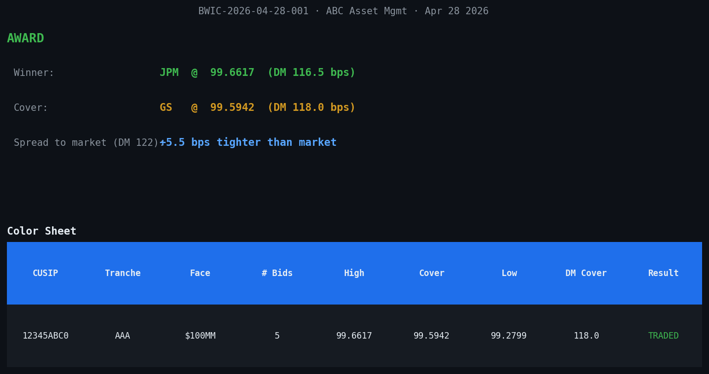

# BWIC Manager

A marimo-based application for running two-round CLO BWIC (Bid Wanted in
Competition) auctions, built on top of `graam` — a Python port of the Graam
structured-credit engine (collateral, waterfall, pricing).



## What it does

- **Setup** — build a BWIC list (CUSIP, tranche, face, NC date, optional
  reserve), upload Intex Excel cashflows for each line under two scenarios
  (Market 20/2/30 and Base 15/5/50), and see DM-to-Mat / DM-to-Call /
  DM-to-Worst at par for every tranche.
- **Round 1** — type bids as they hit your IB; live DM preview updates as
  you type the price; live blotter; countdown timer to the R1 deadline.
- **R1 cut** — top-3 advancing dealers per line computed automatically with
  ties moving (4-way tie at 3rd place → all 4 advance).
- **Round 2** — last-and-best from advancing dealers only; the state machine
  rejects bids below the dealer's R1 best (cannot lower); revisions allowed
  until R2 closes (latest submission wins).
- **Award** — winner, cover (highest bid from a different dealer than the
  winner), DM at award and cover, DNT handling for reserve breaches.
- **Color sheet + Bloomberg IB messages** — copy-pasteable IB messages for
  every phase (announcement, R1 open, R1 closed, R2 last-and-best, color),
  CSV exports for the color sheet and full audit-trail bid log.

## Install

Requires Python 3.11 or newer.

```bash
# Clone
git clone <repo-url> BWIC && cd BWIC

# Install in editable mode (pulls in marimo, pandas, plotly)
pip install -e .

# Optional dev tools (pytest, ruff)
pip install -e '.[dev]'
```

## Run the app

```bash
# Interactive editor (live coding + UI)
marimo edit app.py

# Read-only app server (for end users)
marimo run app.py
```

Marimo opens a browser tab at `http://localhost:2718`.

### Quickstart with the built-in demo

You don't need a real Intex file to try it.

1. Click **Load Demo (AAA $100M S+115)** to load a synthetic AAA tranche
   with a 4-year reinvestment period, 1-year non-call, S+115 bps coupon
   under both scenarios.
2. Optionally adjust **R1 duration** (default 30 min) and **R2 duration**
   (default 15 min).
3. Click **Open Round 1 →**. The R1 bid intake form appears.
4. Submit some bids (line `L1`, dealer `GS`, price `99.50`, etc.). Watch
   the live DM preview update as you type.
5. Click **Close Round 1**. Top-3 advancers compute automatically.
6. Click **Open Round 2 →**, submit improvement bids from advancing
   dealers, then **Close Round 2**.
7. Award screen + color sheet + IB color message render. Use the
   **↓ Color sheet (CSV)** and **↓ Bid log (CSV)** buttons to export.

## Use with real Intex files

Per line, upload one Intex Excel for the **Market** scenario (20 CPR /
2 CDR / 30 SEV) and one for **Base** (15 CPR / 5 CDR / 50 SEV).

The loader is forgiving about column names — it accepts the common Intex
Wave / CDI variants. The required columns are:

| Field        | Accepted column names (case-insensitive)                                  |
| ------------ | ------------------------------------------------------------------------- |
| date         | Date, Pay Date, Payment Date, Period Date                                 |
| beg balance  | Beg Balance, Beginning Balance, Opening Balance                           |
| interest     | Interest, Interest Payment, Coupon Payment                                |
| principal    | Principal, Total Principal (or Sched + Prepaid Principal)                 |
| end balance  | End Balance, Ending Balance, Closing Balance                              |
| **index**    | Index, SOFR, 1m SOFR, Term SOFR, SOFR Forward, LIBOR, 1mL ... (% p.a.)    |

The **index column is required for DM calculation** — each row carries the
SOFR/LIBOR forward rate Intex used to project that period's cashflow, and
the DM solver discounts at `(forward + spread)` per period.

If only an all-in `Coupon` column is present, the loader falls back to
treating the coupon as the forward proxy (less accurate but functional).

## Bloomberg IB messages

Five canonical messages are generated, matching market convention:

```
*** BWIC ANNOUNCEMENT — Tue 04/28/26 ***
Seller:  ABC Asset Mgmt
BWIC ID: BWIC-2026-04-28-001

R1 due:  15:00 EST  (top 3 advance, ties move)
R2 due:  15:30 EST  (last & best)
Color:   post-trade, T+0

LINEUP:
  1) 12345ABC0 AAA $100MM | NC 04/27 | Reserve: NONE
  ...

Format: direct via IB, all-in price (% par).
Bids subject to seller discretion. Cover/color out post-trade.
```

The active message tracks the current phase (announcement → R1 open →
advancers → R2 last-and-best → color); the full set lives in an accordion
below for quick access.

The post-trade color message shows **only the cover** (cover dealer + DM,
bid count) — the winning trade price stays confidential between seller and
winner, per market convention. The award screen on the seller's side
shows full winner/cover detail.

## Project layout

```
BWIC/
├── app.py                  # marimo BWIC Manager app (entry point)
├── render_demo.py          # render the demo BWIC to PNGs (no marimo needed)
├── demo_*.png              # rendered demo screenshots
├── pyproject.toml
│
├── src/graam/              # Python port of the Graam engine
│   ├── analytics.py        #   bond pricing — DM, yield, WAL, duration
│   ├── amortizer.py        #   collateral cashflow projection (CPR/CDR/SEV)
│   ├── bwic_pricing.py     #   DM-to-Mat / DM-to-Call / DM-to-Worst, multi-scenario
│   ├── bwic_workflow.py    #   two-round BWIC state machine
│   ├── intex_loader.py     #   Intex Excel loader with column alias matching
│   ├── interest_rate.py    #   InterestRate + TermStructure
│   ├── solvers.py          #   Brent root finder
│   ├── day_counters.py     #   30/360, Actual/360, Actual/365, Actual/Actual ISDA
│   ├── enums.py            #   Compounding, Frequency, CouponType, ...
│   ├── models.py           #   CashflowEntry, CashflowStream, Asset, Tranche, ...
│   └── waterfall/          #   composable waterfall structures
│
├── examples/
│   └── demo_aaa_bwic.py    # full end-to-end CLI demo (no UI)
│
└── Graam/                  # original Graam C# source (reference)
```

## Run the CLI demo

If you want to see the engine outputs without spinning up the UI:

```bash
python examples/demo_aaa_bwic.py
```

Re-render the demo PNGs (uses matplotlib — `pip install matplotlib pillow`):

```bash
python render_demo.py
```

## BWIC conventions (configurable in code)

| Convention            | Default                                                |
| --------------------- | ------------------------------------------------------ |
| Cut to advance        | top 3 by best R1 bid; ties at the cut all advance      |
| R2 floor              | dealer's R1 best (cannot lower; staying flat is OK)    |
| R2 revisions          | allowed until R2 closes; latest submission wins        |
| Cover                 | highest bid from a dealer **other than** the winner    |
| Reserve               | optional; high bid below reserve → DNT                 |
| Worst case            | `min(DM_to_Mat, DM_to_Call)` — lower DM = worse        |
| Day count             | Actual/360 (CLO standard)                              |
| Compounding           | Simple                                                 |
| Standard scenarios    | Market (20/2/30) and Base (15/5/50)                    |

Change these in `src/graam/bwic_workflow.py` and `src/graam/bwic_pricing.py`.

## License

Internal — see repo for details.
